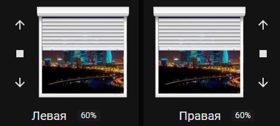
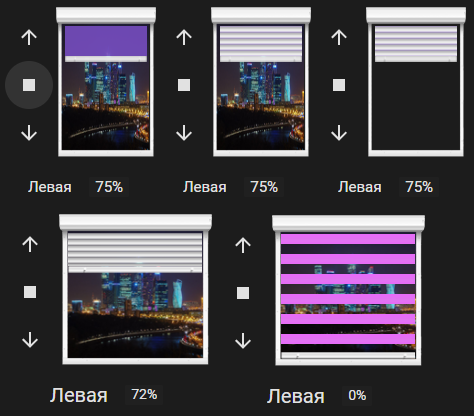
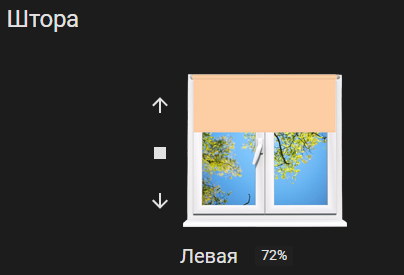

# pic-shutter-card
**Shutter card for Home Assistant Lovelace UI**

**This card allows to open, close or set a shutter to the opening rate you want and also customize the window view with blinds using your images.**

1 sample



2 sample



3 sample



## Install

If you use HACS, the resources will automatically be configured with the needed file.

If you don't use HACS, you can download js file from [latest releases](https://github.com/samoswall/pic-shutter-card/releases). Drop it then in `www` folder in your `config` directory. 

## Configuration

### General

| Name | Type | Required | Default | Description
| ---- | ---- | -------- | ------- | -----------
| type | string | True | - | Must be "custom:pic-shutter-card"
| title | string | False | - | Title of the card

### Entities

| Name | Type | Required | Default | Description
| ---- | ---- | -------- | ------- | -----------
| entity | string | True | - | The shutter entity ID
| name | string | False | _Friendly name of the entity_ | Name to display for the shutter
| buttons_position | string | False | `left` | Set buttons on `left` or on `right` of the shutter
| title_position | string | False | `top` | Set title on `top` or on `bottom` of the shutter
| outside_window | string | False | `not show` | Set it to `show` for visibility of the background picture outside the window
| invert_percentage | boolean | False | `false` | Set it to `true` if your shutter is 100% when it is closed, and 0% when it is opened

_Remark : you can also just give the entity ID (without to specify `entity:`) if you don't need to specify the other configurations._

### Sample

```yaml
type: 'custom:pic-shutter-card'
title: My shutters
entities:
  - entity: cover.left_living_shutter
    name: Left shutter
    buttons_position: left
    title_position: bottom
    outside_window: show
```

## Modification

There are 4 files in the folder where `hass-shutter-card` is installed:

| File | Description
| ---- | -----------
| frame_window.png | window frame (transparent background in the center)
| outside_window.png | view outside the window
| sc_shutter_bottom.png | lower stick on the curtain cloth
| sc_shutter_slide.png | the picture from which the curtain canvas is built by repetition (the picture has a size of 1x6 pin (the upper 4 are white, the lower ones have a gradient in transparency). If you make a picture of 1x20 pix, where the top 10 pix are filled with color, and the bottom 10 pix are transparent, then you get a day-night curtain)

You can replace the pictures to get a new design (3 sample).

Additionally, you can edit using the Home Assistant.
Insert the CSS code in the card code below to redefine the card style.

(If it doesn't work, then install an additional card-mod extension.
In HACS in the User Interface, find in the search and install.
Repository - https://github.com/thomasloven/lovelace-card-mod ).

If you are not going to redefine something, then do not insert lines to change the properties of the CSS class.
Example:
```yaml
.sc-shutter-label {                               # Class name
font-size: 15px !IMPORTANT;                       # Font size change string
}                                                 # Closing parenthesis 
```

css code for changing the card:

```yaml
style: |
  ha-card {
    font-size: 15px !IMPORTANT;                   # Font size for the value %
  }
  .sc-shutter-label {
    font-size: 15px !IMPORTANT;                   # Font size for the name of the curtain
  }
  .card-header {
    font-size: 20px !IMPORTANT;                   # Font size for the card name
    line-height: 20px !IMPORTANT;                 # The height of the line for the card name
    text-align: center !IMPORTANT;                # Alignment of the card name: left center right
  }
  .sc-shutter-selector-slide {
    width: 82% !IMPORTANT;                        # Width of the curtain cloth
    background-color: rgba(117, 76, 191, 0.9);    # Canvas fill color with transparency
    background-image: none !IMPORTANT;            # Disabling the picture for the canvas, a colored background is displayed
  }
  .sc-shutter-outside-window {
    width: 88% !IMPORTANT;                        # Width of the view image outside the window
    height: 90% !IMPORTANT;                       # The height of the picture of the view outside the window
  }
  .sc-shutter-selector-picker {
    width: 82% !IMPORTANT;                        # The width of the picture of the lower shelf on the curtain canvas
    background-size: 100% 6px;                    # For stretching the bottom stick, not cropping, when changing the width.
  }                                               # If you changed the height of the stick image, then change 6px to your height
  .frame-window {
    width: 100px !IMPORTANT;                      # Width of the window frame picture
    height: 150px;                                # The height of the picture of the window frame. Without it, it scales, not shrinks
  }
  .sc-shutter-selector-picture {
    width: 100px !IMPORTANT;                      # The width of the entire window, from which % of the stick, canvas and view outside the window is considered
  }
  .sc-shutter-middle {
    width: 155px !IMPORTANT;                      # The width of the window with control buttons. Equal to the sum of their width
  }
```

## Credits

This card is a modification [hass-shutter-card](https://github.com/Deejayfool/hass-shutter-card).
Thanks to the author of [Deejayfool](https://github.com/Deejayfool).
